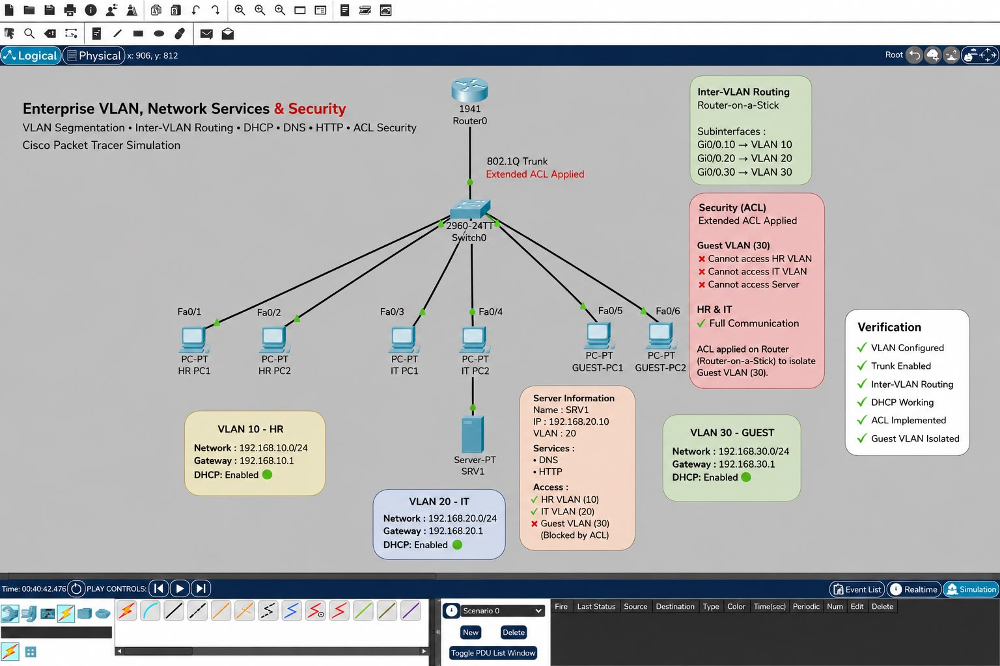

# Enterprise-Network-Security-ACL
Enterprise network security project using VLANs, Inter-VLAN Routing, DHCP, Server, and Extended ACLs in Cisco Packet Tracer.
# Enterprise Network Security ACL

Enterprise network security project implemented in Cisco Packet Tracer.

This project demonstrates VLAN segmentation, Inter-VLAN Routing, DHCP services, and Extended Access Control Lists (ACLs) to isolate the Guest VLAN while allowing authorized communication between internal departments.

---

## Project Overview

The network consists of three departments connected through a Layer 2 switch and a Router-on-a-Stick architecture.

- HR Department (VLAN 10)
- IT Department (VLAN 20)
- Guest Department (VLAN 30)

A central server provides network services, while an Extended ACL protects internal resources from unauthorized Guest access.

---

## Network Topology



---

## Features

- VLAN Segmentation
- Inter-VLAN Routing (Router-on-a-Stick)
- 802.1Q Trunk Configuration
- DHCP Configuration
- DNS Server
- HTTP Server
- Extended ACL Security
- Guest VLAN Isolation

---

## IP Addressing

| VLAN | Department | Network | Gateway |
|------|------------|----------------|---------------|
| 10 | HR | 192.168.10.0/24 | 192.168.10.1 |
| 20 | IT | 192.168.20.0/24 | 192.168.20.1 |
| 30 | Guest | 192.168.30.0/24 | 192.168.30.1 |

---

## Server Information

| Service | Status |
|---------|--------|
| DNS | Enabled |
| HTTP | Enabled |
| DHCP | Enabled |

Server IP Address:

```
192.168.20.10
```

---

## Security Policy (Extended ACL)

Guest VLAN (30):

- Cannot access HR VLAN
- Cannot access IT VLAN
- Cannot access the Server

HR VLAN (10):

- Full communication allowed

IT VLAN (20):

- Full communication allowed

---

## Verification

✔ VLANs Configured

✔ 802.1Q Trunk Enabled

✔ Inter-VLAN Routing Working

✔ DHCP Working

✔ Extended ACL Implemented

✔ Guest VLAN Successfully Isolated

---

## Technologies Used

- Cisco Packet Tracer
- Cisco IOS
- VLAN
- Router-on-a-Stick
- 802.1Q Trunking
- DHCP
- DNS
- HTTP
- Extended Access Control Lists (ACL)

---

## Author

**Rawan Alqahtani**

Computer Science Graduate – Network Security
